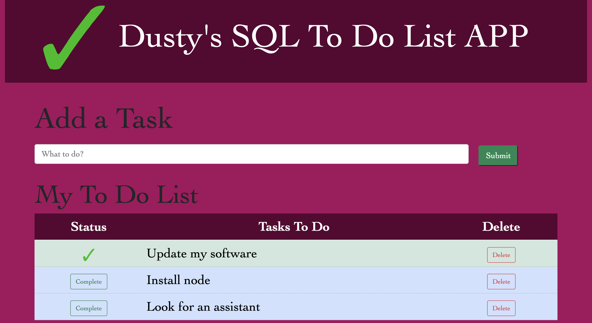

# Dusty's Full-Stack To Do List APP

## Description

_Duration: Weekend Project_

This To Do List app allows a user to submit custom to do list tasks. Upon submission each task is stored in a database and displayed on the DOM in the order they were created. As each item in the list is rendered, two buttons are rendered with them as well, a "complete" button and a "delete" button. When the user is finished with a task that they are tracking with this app, they can click on the "complete" button which will show more green on hover. Once clicked, the button will change to a green check mark as well as the background of the row that the task is on. At any time, if a user wants to remove a task from the todo list, they can use the "delete" button on the task's row. This will remove the task from both the DOM and the database. A warning message will appear before the Delete event occurs to be sure the user understands there is no going back.

Designed responsively to show on smaller device screens.

### Prerequisite

Required software:

- [Node.js](https://nodejs.org/en/)
- [Postgres](https://www.postgresql.org/download/)
- [Postico](https://eggerapps.at/postico/)

## Installation

1. Create a database named `weekend-to-do-app`,
2. The queries in the `database.sql` file are set up to create all the necessary tables and populate the needed data to allow the application to run correctly. The project is built on [Postgres](https://www.postgresql.org/download/), so you will need to make sure to have that installed. We recommend using Postico to run those queries as that was used to create the queries,
3. Open up your editor of choice and run an `npm install`,
4. Run `npm start` in your terminal, this should start your server.
5. Open you're browser and got to `localhost:5000`,

## Usage

1. User is working on a project that has sever tasks, but doesn't want to lose track of it as a physical list.
2. User opens this app and inputs the tasks one by one.
3. Database stores the tasks so that the user can close out of the app but still access the same tasks on reload.
4. As user completes the tasks, they can mark them as complete for organization.
5. If a user wishes to delete a completed or incomplete task, they can press the delete button that renders next to said task.
6. On delete, a warning box will appear to make sure the user didn't mistakenly press delete.

## Built With

This app is built with HTML, CSS, Javascript, jQuery, Bootstrap, SweetAlert, Ajax, Postgres, and SQL.

## Acknowledgement

Thanks to [Prime Digital Academy](www.primeacademy.io) who equipped and helped me to make this application a reality.
